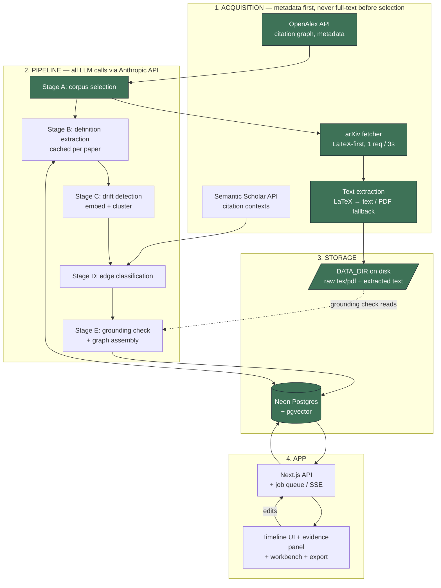
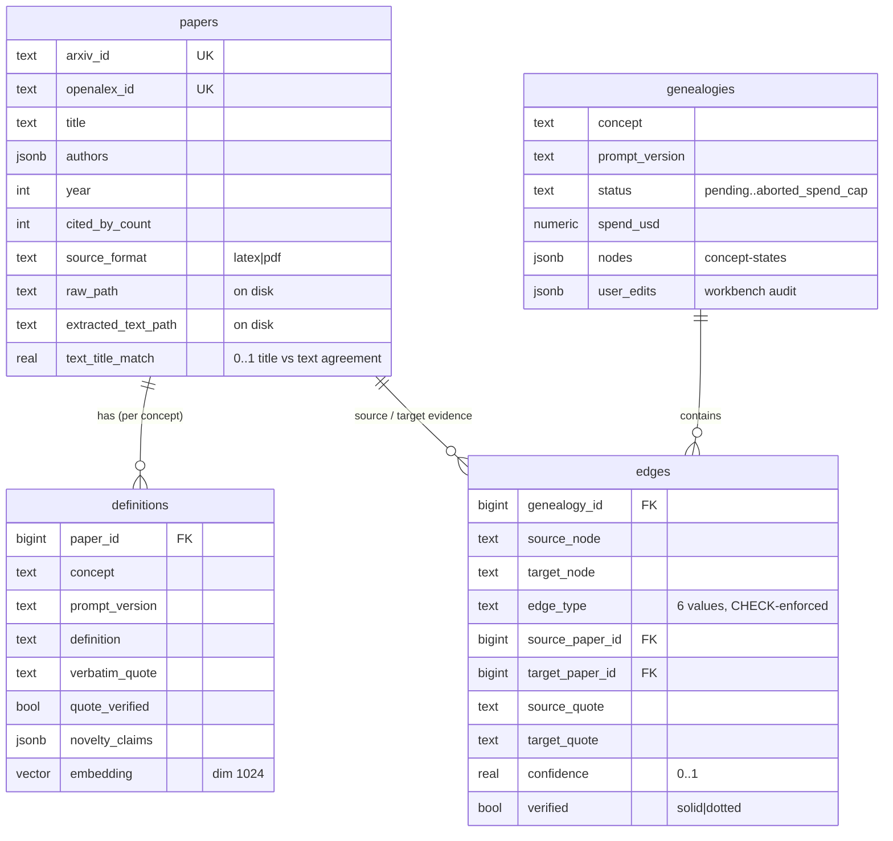

# Lineage — System Architecture

Status legend: ✅ built & working · 🟡 partial · ⬜ planned

Lineage traces how an academic concept (showcase: *attention*) evolved across
~150 arXiv papers, producing an interactive, evidence-backed genealogy: a
timeline of **concept-states** (nodes) connected by **typed, evidence-backed
relationships** (edges). This document describes how the system is put together;
[CLAUDE.md](../CLAUDE.md) holds the product spec and rules it must honour.

---

## 1. Guiding principles

These shape every decision below:

1. **Evidence or it doesn't ship.** Every displayed edge carries verbatim quotes
   from *both* papers, and every quote is string-verified against extracted
   source text (the *grounding check*). Verified → solid edge; failed/inferred →
   dotted and labelled "inferred". An unverified quote is never shown as verified.
2. **Workbench, not oracle.** Users can split/merge/rename/delete nodes and
   reclassify/delete edges. The UI never claims the map is *the* history.
3. **Never fabricate** paper metadata, quotes, or citations — including in exports.
4. **Cost discipline from day one.** Per-stage token logging, a per-trace spend
   cap that aborts cleanly, and a `--dry-run` estimator.
5. **Boring tech.** One repo, one database, one Next.js app, one worker. No
   microservices, brokers, or Kubernetes.

---

## 2. The four zones



Data flows left-to-right through acquisition → pipeline → storage, then the app
reads assembled genealogies out of storage and writes user edits back.

**Hard rule for the acquisition zone:** metadata first. We never fetch full text
for a paper before it has survived corpus selection — that's what keeps a trace
cheap and polite.

---

## 3. Zone 1 — Acquisition

| Component | Source | Rules | Status |
|---|---|---|---|
| Metadata + citation graph | **OpenAlex** (free, no key) | Use the polite pool (`mailto`); paginate via cursor | ✅ |
| Citation contexts | **Semantic Scholar** (free key) | Respect rate limits; sentences around a citation feed Stage D | ⬜ |
| Paper source | **arXiv** | LaTeX source preferred, PDF fallback; **1 request / 3 s**, real User-Agent, exponential backoff on 429/5xx | ✅ |
| Text extraction | local | LaTeX → text (`pylatexenc`, `\input` inlined); PDF fallback via `pymupdf` with de-hyphenation, incl. PDFs embedded in `\includepdf` source stubs | ✅ |

**Why metadata-first matters:** OpenAlex gives us titles, years, citation counts,
and the reference graph for free. We rank and cap the corpus on that *before*
spending a single arXiv download or LLM token. Full text is only fetched for the
papers that make the cut.

Shared HTTP plumbing lives in [`pipeline/common.py`](../pipeline/common.py): a
`requests` session with a proper User-Agent and exponential backoff on
429/5xx, plus `.env` loading and a Windows UTF-8 console fix.

---

## 4. Zone 2 — Pipeline (LLM stages)

Every stage is a **standalone CLI script** runnable before any UI exists. All LLM
calls go through the Anthropic API. Cost is logged per stage and checked against
the spend cap.

| Stage | Input | Output | Caching | Status |
|---|---|---|---|---|
| **A · Corpus selection** | concept string | ranked ≤150-paper corpus (metadata) | — | 🟡 |
| **B · Definition extraction** | one paper's text | JSON `{definition, verbatim_quote, section, novelty_claims}` | **per paper**, keyed by arXiv ID + `PROMPT_VERSION` | ⬜ |
| **C · Drift detection** | all definitions | embeddings → clusters → concept-states (nodes) | — | ⬜ |
| **D · Edge classification** | citation-linked pairs across clusters + citation contexts | one of six edge types + a quote from each paper + confidence 0–1 | — | ⬜ |
| **E · Grounding check + assembly** | candidate edges + extracted text | verified/inferred edges → genealogy JSON | full trace output immutable once built | ⬜ |

### Stage A as built (🟡)

[`pipeline/corpus_select.py`](../pipeline/corpus_select.py) implements the first
half of Stage A, live against OpenAlex:

1. **Seed selection** — two modes:
   - **Search mode (default):** relevance search over arXiv+CS work
     title/abstract/fulltext.
   - **Concept mode (`--concept-id`/`--concept-mode`):** works tagged with an
     OpenAlex concept.
2. **One-hop expansion** — count references across the seeds; fetch the works the
   corpus itself most often cites (≥2 references), in batches of 50.
3. **Dedup on arXiv ID** — OpenAlex keeps separate preprint/published records for
   one paper; we key on the arXiv ID and keep the best record.
4. **Rank** — `2·log1p(in-corpus refs) + log1p(citations)`, capped at `--limit`.
   Prints a table; `--json` exports it.

> **Design note — why search is the default.** OpenAlex's (deprecated) concept
> taxonomy has **no ML "attention" node**; the bare word resolves to the ADHD
> sense, and the Computer-Science filter can't fix it because ML-for-healthcare
> papers are legitimately tagged CS. Relevance search is therefore the reliable
> path for the showcase concept.

**Still to do for Stage A (🟡→✅):** the **embedding relevance filter** that trims
one-hop noise (e.g. generic highly-cited references that aren't about the concept)
down to the final ranked corpus.

---

## 5. Zone 3 — Storage

Two stores, split on a deliberate line:

- **Neon Postgres (+ pgvector)** — structured, queryable state: papers,
  definitions (with embeddings), edges, genealogies, user edits. ✅ live.
- **Disk (`DATA_DIR`)** — bulky raw artifacts: `.tex`/`.pdf` source and extracted
  text. ⬜ (created when the fetcher lands).

**Why the split:** keeping multi-KB/MB raw text out of the database keeps Neon
tiny (a full trace ≈ ~2 MB, dominated by embedding vectors) and cheap, while disk
holds the heavy files the grounding check reads.

### Data model



Enforced in the schema itself (not just app code):

- **Edge taxonomy is a `CHECK` constraint** — exactly six values: `extends`,
  `contests`, `narrows`, `renames`, `migrates`, `merges`. The database rejects
  anything else.
- **`confidence` is constrained to 0–1**; `genealogies.status` to a fixed set
  including `aborted_spend_cap`.
- **Definition cache key** = `UNIQUE(paper_id, concept, prompt_version)`, so an
  extraction is computed once per paper per prompt version and reused across
  traces. Bump `PROMPT_VERSION` to invalidate.

> **Design note — the metadata mismatch guard (`papers.text_title_match`).**
> A successful download proves *some* text exists, not that it's the *right*
> text: OpenAlex sometimes pairs a title with another paper's arXiv ID. Observed
> live — a work titled *"AI-Assisted Pipeline … Health Supplement Content"*
> carries BERT's arXiv ID (`1810.04805`) and citation count; fetching it returns
> BERT's real source. `extract_text.py` therefore scores the fraction of
> significant title words present in the extracted text (good papers score 100%;
> that record scores 22%). The row is kept and flagged rather than silently
> dropped — **downstream stages must require `text_title_match >= 0.5`**, not
> merely a non-null `extracted_text_path`.

Migrations are plain SQL in [`pipeline/db/migrations/`](../pipeline/db/migrations),
applied by an idempotent runner ([`migrate.py`](../pipeline/db/migrate.py)) that
records applied versions in a `schema_migrations` ledger. `001_init.sql` is ✅
applied live to Neon; pgvector 0.8.0 verified enabled.

---

## 6. Zone 4 — App

⬜ Phase 3+. A **Next.js 15** front end + API. Trace builds run on a **job queue**
with **server-sent progress events** ("Reading paper 47 of 132…"). The UI renders
the genealogy JSON as a timeline canvas with an evidence panel (two facing
quote-cards + a verification stamp), plus workbench editing and export
(related-work Markdown skeleton + BibTeX).

Currently `app/` is a scaffold: layout, a placeholder page, and `globals.css`
pre-loaded with the approved design tokens (palette, per-edge-type colours,
fonts). The app reads `DATABASE_URL` — the **pooled** Neon endpoint for
serverless — while the pipeline uses the **direct** endpoint.

---

## 7. Cross-cutting: cost & safety

| Control | Mechanism | Status |
|---|---|---|
| Per-trace spend cap | `TRACE_SPEND_CAP_USD` (default 10); aborts the job cleanly, recorded as `genealogies.status = aborted_spend_cap` | ⬜ (schema ready) |
| Dry-run | `--dry-run` estimates cost without calling the LLM | ⬜ |
| Per-stage token logging | logged as the pipeline runs; `genealogies.spend_usd` accumulates | ⬜ |
| Grounding check | string-verify every quote vs extracted text before display | ⬜ (schema flags ready: `quote_verified`, `edges.verified`) |
| Unfetchable papers | fetch failure ⇒ no `papers` row ⇒ never reaches the pipeline | ✅ |
| Metadata mismatch | `text_title_match` score; flagged, not silently dropped (see §5) | ✅ |
| Secrets | `.env` only (gitignored); `.env.example` documents the keys | ✅ |
| Immutability | per-paper extractions and full trace outputs are immutable once built; invalidate only on `PROMPT_VERSION` bump | 🟡 (cache key in schema) |

**The real budget constraint is LLM spend, not infrastructure.** At 150 papers the
database is effectively free; the Anthropic API bill is the meter that matters,
which is why the spend cap and dry-run are first-class.

---

## 8. Tech stack & key decisions

| Choice | What | Why |
|---|---|---|
| **Database** | Neon serverless Postgres + pgvector | No local install; matches the Ask Ravi project; local-DB speed is irrelevant at 150 papers. `docker-compose.yml` remains as an optional local fallback. |
| **Neon endpoint** | direct (unpooled) for the pipeline; pooled for the deployed app | Pooling suits many short serverless connections; the pipeline is one long-running process doing DDL + batch writes. |
| **Pipeline language** | Python | Standalone CLI per stage; strong scientific/HTTP ecosystem. |
| **App** | Next.js 15 (App Router) | Single front end + API; SSE for progress. |
| **LLM** | Anthropic API | Per spec; all pipeline model calls route through it. |
| **Seed selection** | search-first, concept optional | OpenAlex has no ML "attention" concept (see §4). |

---

## 9. Repository layout

```
Concept Geneology/
├── CLAUDE.md              # product spec + rules (source of truth)
├── docs/ARCHITECTURE.md   # this document
├── docker-compose.yml     # optional local Postgres+pgvector fallback
├── .env.example           # documented config; real .env is gitignored
├── pipeline/
│   ├── common.py          # env + polite HTTP (backoff, User-Agent)
│   ├── corpus_select.py   # Stage A (part 1)  ✅
│   ├── requirements.txt
│   └── db/
│       ├── migrate.py     # idempotent migration runner
│       └── migrations/001_init.sql
└── app/                   # Next.js 15 scaffold (Phase 3+)
```

---

## 10. Build status & sequence

Work proceeds in the order set by [CLAUDE.md](../CLAUDE.md) §"Build phases":

1. ✅ Scaffold, env handling, DB migration (live on Neon).
2. ✅ Stage A part 1 — `corpus_select.py` (ranked corpus, metadata only).
3. ✅ arXiv fetcher (`fetch_papers.py`, LaTeX-first, 1 req/3s, backoff) + text
   extraction (`extract_text.py`, `pylatexenc`/`pymupdf`) — papers land with raw +
   extracted text.
4. ⬜ **Next:** embedding relevance filter (finishes Stage A).
5. ⬜ Pipeline stages B–E end-to-end on *attention* → genealogy JSON.
6. ⬜ UI: timeline + evidence panel → workbench + export.
7. ⬜ Trace-build UX: job queue, live progress, save/load.

## 11. Explicitly out of scope

Reference-manager integration, collaboration/sharing, PDF annotation, non-arXiv
sources, browser extension, mobile apps, social features, and a formal
eval harness/golden set. Not built, not scaffolded "for later".
